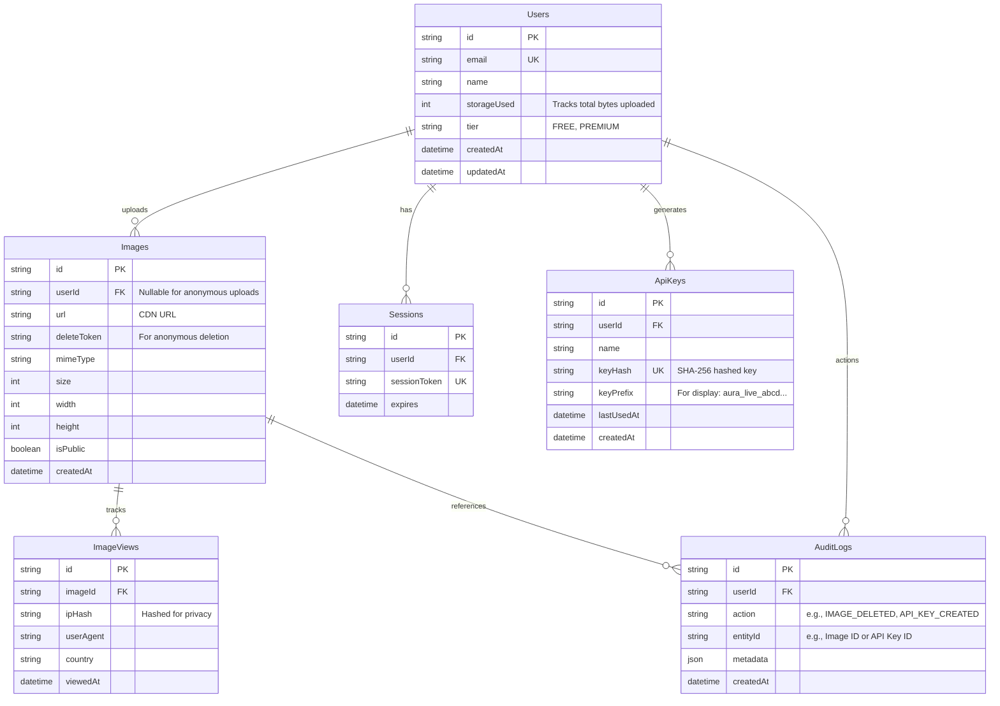

# Database Design & Architecture
## Phase 3 Deliverable

---

## 1. Entity-Relationship Diagram (ERD)

This diagram outlines the relationships between the core entities required for the Image Upload & Share platform.

---

## 2. Table Structures & SQL Design

We will use **PostgreSQL (hosted on Supabase)** as the primary relational database. The schema is designed for high concurrency, with careful attention paid to index selection for fast lookups.

### 2.1 Users
* **Primary Key**: `id` (UUID)
* **Unique Constraints**: `email`
* **Indexes**: None specifically required beyond PK/UK.

### 2.2 Images
* **Primary Key**: `id` (CUID or Nanoid for short URL-friendly IDs like `x9f2k3`)
* **Foreign Key**: `userId` (References `Users(id)`, ON DELETE SET NULL)
* **Indexes**: 
  - `idx_images_user_id_created_at` (Speeds up dashboard queries and sorting by date).
  - `idx_images_delete_token` (Fast lookup for anonymous deletions).

### 2.3 ApiKeys
* **Primary Key**: `id` (UUID)
* **Foreign Key**: `userId` (References `Users(id)`, ON DELETE CASCADE)
* **Unique Constraints**: `keyHash`
* **Indexes**: 
  - `idx_api_keys_key_hash` (Critical for authenticating incoming API requests instantly).

### 2.4 ImageViews (Analytics)
* **Primary Key**: `id` (UUID)
* **Foreign Key**: `imageId` (References `Images(id)`, ON DELETE CASCADE)
* **Indexes**: 
  - `idx_image_views_image_id_viewed_at` (For generating time-series graphs of views per image).

### 2.5 AuditLogs
* **Primary Key**: `id` (UUID)
* **Foreign Key**: `userId` (References `Users(id)`)
* **Indexes**:
  - `idx_audit_logs_user_id_action` (For filtering user history).

---

## 3. Storage Quota Mechanism (Optimization)
Instead of running an expensive `SUM(size) FROM Images WHERE userId = ?` every time a user wants to upload an image, we maintain a `storageUsed` integer column on the `Users` table. 
* **Upload**: `UPDATE Users SET storageUsed = storageUsed + new_image_size WHERE id = ?`
* **Delete**: `UPDATE Users SET storageUsed = storageUsed - deleted_image_size WHERE id = ?`

---

## 4. Migration Plan

1. **Initial Migration (`001_init`)**: Create `Users` and `Sessions` tables for Auth.js integration.
2. **Core Domain Migration (`002_images`)**: Create `Images` table with its foreign keys and custom short ID generation.
3. **Analytics Migration (`003_analytics`)**: Create `ImageViews` and `AuditLogs` for tracking and security.
4. **Developer Tools Migration (`004_api_keys`)**: Create `ApiKeys` table.
