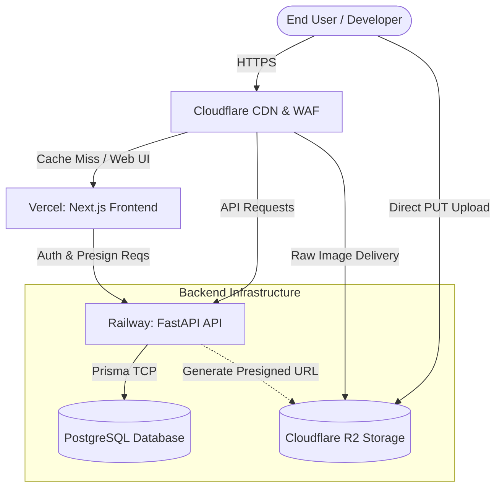
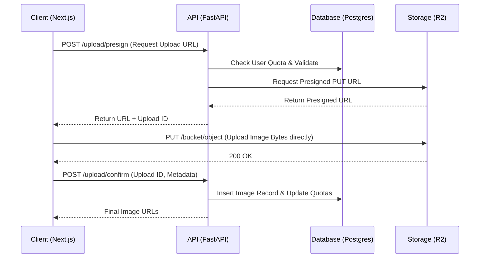
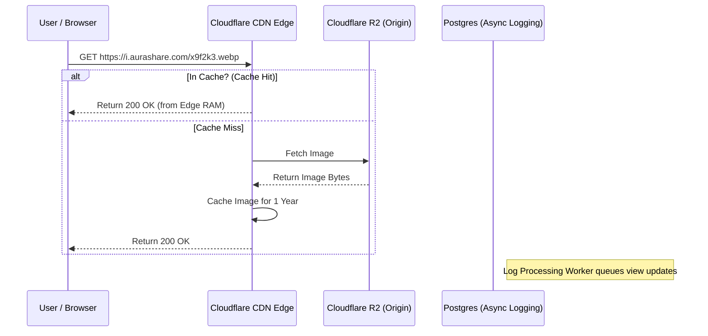

# System Design & Architecture
## Image Upload & Share Platform (Codename: "AuraShare")

---

## 1. High-Level Architecture

The platform follows a modern, decoupled, serverless-friendly architecture built on Python, designed for high throughput, fast delivery, and massive scalability.

* **Frontend**: Next.js (App Router), deployed on **Vercel** for edge rendering and optimal global performance.
* **Backend API**: FastAPI (Python), deployed on **Railway** as stateless containers for predictable, horizontal scaling.
* **Database**: PostgreSQL with SQLModel ORM (hosted on **Supabase** for high durability, performance, and serverless scalability).
* **Storage**: **Cloudflare R2** (S3-compatible, zero egress fees, global replication).
* **CDN / DNS**: **Cloudflare**, acting as the primary edge layer to cache and serve images with extreme low latency.

---

## 2. Component Diagram

---

## 3. Request Flow Diagrams

### 3.1. Upload Request Flow (Web UI)
To minimize API load and maximize upload speed, files are uploaded directly from the client to the storage layer via presigned URLs.

### 3.2. Delivery Request Flow
Images are heavily cached at the Cloudflare edge layer. The origin (R2) is only queried when an image isn't in the edge cache.

---

## 4. Storage Architecture (Cloudflare R2)

**Why Cloudflare R2?** 
AWS S3 charges significant fees for bandwidth out (egress). Since this platform is an image sharing service, bandwidth out will be our largest cost. Cloudflare R2 offers **zero egress fees** and seamless integration with Cloudflare CDN, making it the financially viable choice for heavy read operations.

* **Bucket Strategy**: Single primary bucket (`aurashare-production`).
* **Object Naming**: Random cryptographically secure 12-character strings (e.g., `a7X9m2PqL4x1.webp`) to prevent enumeration attacks and ensure uniform distribution across storage partitions.
* **Lifecycle Policies**: None for MVP, as images are permanent. A future lifecycle rule might handle soft-deleted images (archived for 30 days before hard deletion).

---

## 5. CDN Architecture

**Domain Strategy**:
1. `aurashare.com`: Frontend Next.js app.
2. `api.aurashare.com`: FastAPI Backend.
3. `i.aurashare.com`: Direct image delivery domain pointing to the R2 bucket.

**Caching Rules (`i.aurashare.com`)**:
* **Cache-Control**: `public, max-age=31536000, immutable` (Cache for 1 year).
* **Browser Cache TTL**: 1 year.
* **Edge Cache TTL**: 1 month.
* **Purge Mechanism**: When a user deletes an image via the dashboard, the FastAPI API will call the Cloudflare API to purge the cache for that specific URL.

---

## 6. Security Architecture

### 6.1. Authentication & API Security
* **User Authentication**: Auth.js handling OAuth (GitHub) and Magic Links (JWT stored in secure `HttpOnly` cookies).
* **API Key Management**: 
  - API keys are randomly generated 256-bit strings.
  - Stored in the database as **SHA-256 Hashes** (similar to passwords). The raw key is only shown to the user once.
  - FastAPI uses Auth Guards to extract the `Bearer <key>`, hash it, and query the DB.

### 6.2. Upload Security
* **Presigned URLs**: Prevent unauthorized uploads. URLs expire after 10 minutes.
* **Rate Limiting**: IP-based rate limiting via Cloudflare WAF and FastAPI `ThrottlerModule`.
* **File Type Validation**: Enforced both on the FastAPI API (during presign generation) and at the Cloudflare R2 level (Content-Type constraints on the presigned URL).
* **Size Limits**: Enforced strictly through R2 presigned upload conditions (`content-length-range`).

---

## 7. Scalability Strategy

* **Horizontal API Scaling**: The FastAPI application stores zero state in memory. Sessions are managed via JWT/DB, and temporary uploads don't touch the server filesystem. We can scale Railway containers from 1 to 100 instantly.
* **Database Connection Pooling**: Prisma will be configured with connection pooling (`pgbouncer` or Prisma's built-in pool) to handle thousands of concurrent serverless requests without exhausting Postgres connections.
* **Quota Management**: To handle storage quotas efficiently without doing a `SUM(size)` query on every upload, we will maintain a `storageUsed` integer column on the `Users` table, which gets incremented/decremented upon upload/deletion.
* **Asynchronous Jobs**: Heavy tasks like sending emails (Stripe receipts, magic links) or batch deleting large volumes of images will be offloaded to a Redis-backed queue (e.g., BullMQ) running on a background worker.
