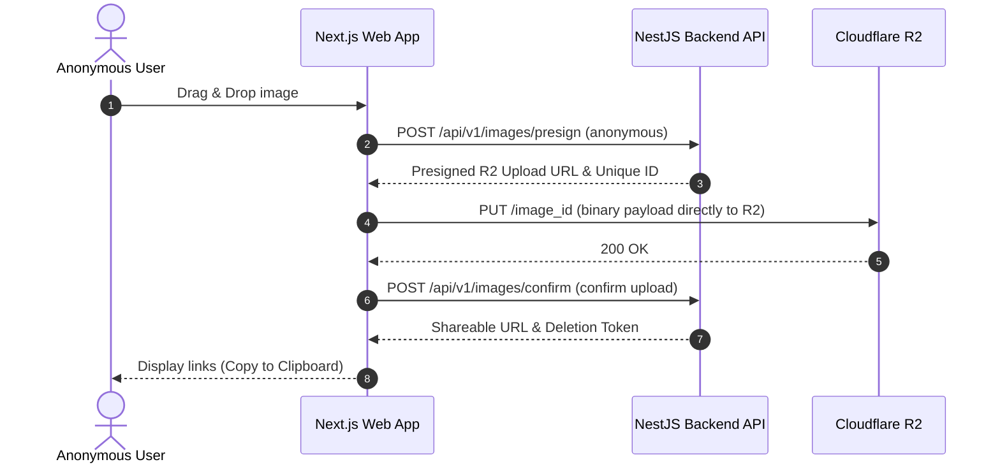
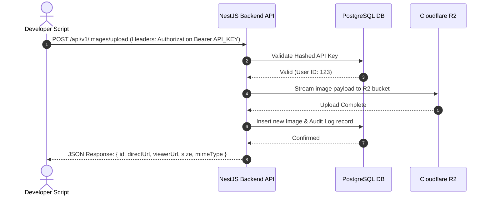

# Product Requirements Document (PRD)
## Image Upload & Share Platform (Codename: "AuraShare")

---

## 1. Executive Summary & Vision

**AuraShare** is a high-performance, developer-friendly, and consumer-friendly image hosting and sharing platform. The mission is to provide an ultra-fast, secure, and infinitely scalable platform where users can upload images, receive permanent, optimized public URLs, and have those images render seamlessly across any client, application, or markdown viewer globally. 

We aim to combine the developer accessibility of Cloudinary with the casual ease-of-use of Imgur.

---

## 2. User Stories

### 2.1 Anonymous Consumer
* **Story**: As an unregistered visitor, I want to drag and drop an image on the landing page so that I can instantly upload it and get a shareable URL without going through a sign-up flow.
* **Story**: As an unregistered visitor, I want to copy a custom "deletion link" upon upload so that I can delete the image later if I choose to.

### 2.2 Registered User
* **Story**: As a registered user, I want to log in using passwordless options (OAuth, Magic Links) so that my account remains secure and quick to access.
* **Story**: As a registered user, I want to see a personal dashboard containing all my uploaded images, their sizes, upload dates, and view counts so that I can manage my hosted media efficiently.
* **Story**: As a registered user, I want to upgrade to a premium subscription when I hit my free storage limit so that I can continue uploading without interruptions.
* **Story**: As a registered user, I want to delete my uploaded images at any time from my dashboard to reclaim privacy.

### 2.3 Developer Persona
* **Story**: As a developer, I want to generate and manage API Keys from my dashboard so that I can programmatically upload images from my own applications, scripts, or blogs.
* **Story**: As a developer, I want my uploaded images to have clean, customizable direct-link paths (e.g., `https://i.aurashare.com/abc123xyz.png`) that bypass HTML wrapper pages, ensuring they render perfectly in Markdown, Slack, Discord, and native `` tags.
* **Story**: As a developer, I want to query detailed usage analytics (views, bandwidth consumed) for my API-uploaded images to understand traffic patterns.

---

## 3. Functional Requirements

### 3.1 Upload Engine
* **Multi-Format Support**: Accept PNG, JPEG, WEBP, GIF, and SVG formats.
* **Storage Rules & Quotas**: 
  - **Permanence**: All uploaded images are stored permanently in our Cloudflare R2 folder and never expire unless manually deleted by the user.
  - **Anonymous Limits**: Max 10MB per image. Total free storage limit applies.
  - **Registered (Free Tier)**: Max 50MB per image. Total free storage quota applies (e.g., 2GB).
  - **Registered (Premium Tier)**: Larger per-image limits and expanded storage unlocked via a paid subscription.
* **Upload Mechanisms**:
  - Web UI: Drag-and-drop zone, file explorer pick, and clipboard paste (Ctrl+V).
  - API: Standard multipart form POST endpoint `/api/v1/images/upload`.
* **Direct-to-Storage Presigned Uploads**: Web client requests a secure presigned URL from the API and uploads directly to Cloudflare R2 to maximize throughput and minimize backend server load.

### 3.2 Delivery & Rendering Engine
* **Dual URL Routing**:
  - **Direct Image Link**: `https://i.aurashare.com/:id.:ext` (e.g., `i.aurashare.com/x9f2k3.webp`). Returns the raw image file with correct MIME types and aggressive CDN caching headers (`Cache-Control: public, max-age=31536000, immutable`).
  - **Viewer Page Link**: `https://aurashare.com/v/:id` (e.g., `aurashare.com/v/x9f2k3`). A beautiful responsive landing page displaying the image, its meta details, dimensions, and quick-copy buttons for Direct Link, Markdown Embed, HTML Embed, and Forum BBCode.
* **Image Auto-Optimization**:
  - On upload, process images to generate multiple responsive widths and convert to highly efficient WEBP format to save storage and CDN bandwidth.

### 3.3 Dashboard & User Management
* **Authentication**: Passwordless email magic links and OAuth (GitHub, Google) powered by Auth.js.
* **Dashboard View**: Grid and list views of uploaded files with sorting (date, views, size) and filtering capabilities.
* **Bulk Operations**: Select multiple images for batch deletion.

### 3.4 API Platform
* **API Key Lifecycle**: Create, label, roll/regenerate, and revoke API keys.
* **API Analytics**: Displays monthly usage graphs, total request volume, bandwidth, and view trends.

---

## 4. Non-Functional Requirements

### 4.1 Performance & Latency
* **Global Delivery**: Image delivery latency (Time to First Byte - TTFB) must be **< 150ms** anywhere in the world via Cloudflare's Edge network.
* **Web UI Core Web Vitals**:
  - Largest Contentful Paint (LCP) < 1.2s.
  - Cumulative Layout Shift (CLS) < 0.1.

### 4.2 Scalability & Availability
* **High Availability**: Aim for **99.99%** availability for both the image viewing delivery network and the upload endpoints.
* **Decoupling**: Upload pipeline must handle sudden spikes without degrading reading/sharing performance. Storage operations must run asynchronously using background queues if heavy transformations are required.
* **Stateless API**: NestJS API nodes must be fully stateless to support horizontal autoscaling on Railway.

### 4.3 Security & Compliance
* **Content Safety**: Integrations for content safety check/moderation (e.g., blocking NSWM, CSAM, malware/executables masked as images).
* **Rate Limiting**:
  - Anonymous uploads: Limit to 10 uploads per IP per hour.
  - Authenticated API uploads: Standard rate limit of 100 requests per minute per API Key (customizable for enterprise).
* **API Security**: Secure hash storage for API keys (e.g., using SHA-256 to save/verify API Keys in the DB, showing the actual secret token ONLY once upon creation).
* **CORS Policies**: Restricted API origins where applicable, open direct image routing for hotlinking.

### 4.4 Monitoring & Observability
* **Logging**: Structured JSON logging using Pino on the backend, tracking request routes, response times, and system exceptions.
* **Metrics**: Prometheus metrics exported to Grafana for visualizing system health, HTTP error rates (4xx, 5xx), and database connection pool sizes.

---

## 5. User Flows

### Flow A: Anonymous Web Upload

### Flow B: API Developer Upload

---

## 6. Success Metrics

* **Image Upload Success Rate**: > 99.9% of started uploads must complete successfully.
* **Image View Cache Hit Rate**: > 95% of direct image requests should serve directly from the Cloudflare CDN edge instead of hitting the R2 storage origin.
* **System Growth Metrics**:
  - Monthly Active Users (MAU).
  - Total Terabytes Hosted.
  - Active API integrations.

---

## 7. MVP vs. Future Scope

| Feature Area | MVP Scope (Phase 1-4 Focus) | Future Scope |
| :--- | :--- | :--- |
| **Authentication** | Magic Link Email & GitHub OAuth | Google, Apple, SAML/SSO, Passkeys |
| **Storage & Optimization**| WEBP conversion, R2 preservation, 1 size | Multi-resolution resizing, Smart Cropping, AVIF |
| **Analytics** | View counter (simple increment) | Detailed geolocation, referral, bandwidth tracking |
| **Collaboration** | Single User ownership | Team workspaces, collaborative galleries |
| **Custom Domains** | Single global domain (`i.aurashare.com`) | White-labeled custom CNAME support (`cdn.mycompany.com`) |
| **Monetization** | Free tier with storage limits, Stripe integration for premium subscription | Advanced tiering for teams and enterprise |

---

## 8. Detailed Feature List & Acceptance Criteria

### Feature 1: Landing Page Upload Component
* **Description**: A highly responsive, visual, drag-and-drop upload zone on the home page.
* **Acceptance Criteria**:
  - Must accept files via drag-and-drop, file selector, or copy-paste.
  - Must immediately validate files before initiating upload (size < 10MB for anonymous, file type must match image mime-types).
  - Must display a real-time progress bar while the file is transferring.
  - On completion, displays a success card containing:
    - Direct Image URL (Copyable)
    - Viewer Page URL (Copyable)
    - Markdown embed code (Copyable)
    - Deletion Link (for anonymous uploads).

### Feature 2: Registered User Dashboard
* **Description**: A grid interface showing all images owned by the user.
* **Acceptance Criteria**:
  - Paginated list (default 24 items per page).
  - Displays thumbnail, title, upload date, file size, and view count.
  - Actions: Open link, Copy direct link, and Delete image (triggers a confirmation modal).
  - Search bar to filter images by title/filename.

### Feature 3: Direct Link Delivery Endpoint (`i.aurashare.com`)
* **Description**: The high-performance sub-domain/endpoint responsible for rendering raw images.
* **Acceptance Criteria**:
  - Must stream the binary image payload with correct content-type header (e.g. `image/png`, `image/webp`).
  - Must supply header `Cache-Control: public, max-age=31536000, immutable`.
  - Under the hood, any hit to this route increments the image's `ImageViews` table inside the database asynchronously (we can queue this to prevent locking the database).
  - Must return `404 Not Found` immediately for nonexistent or soft-deleted images.

### Feature 4: API Key Management
* **Description**: Dashboard tab where developers manage custom API keys.
* **Acceptance Criteria**:
  - User can click "Generate API Key", input a descriptive name, and receive a newly generated key.
  - **CRITICAL**: The key must be displayed to the user EXACTLY ONCE. Afterward, only its mask (e.g. `aura_live_xxxx...abcd`) and name are visible.
  - User can delete/revoke keys at any time. Revoked keys must immediately block subsequent API requests.
